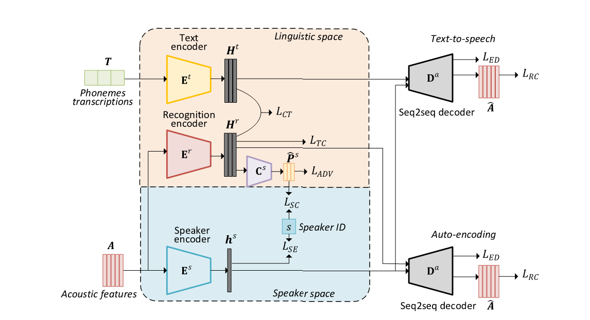

# Non-parallel Seq2seq Voice Conversion

Implementation code of [Non-Parallel Sequence-to-Sequence Voice Conversion with Disentangled Linguistic and Speaker Representations](https://arxiv.org/abs/1906.10508).

For audio samples, please visit our [demo page](https://jxzhanggg.github.io/nonparaSeq2seqVC/).



## Dependencies

* Python 3.6
* PyTorch 1.0.1
* CUDA 10.0

## Data

It is recommended you download the [VCTK](http://homepages.inf.ed.ac.uk/jyamagis/page3/page58/page58.html) and [CMU-ARCTIC](http://www.speech.cs.cmu.edu/cmu_arctic/packed/) datasets.

## Usage

### Installation

Install Python dependencies.

```bash
$ pip install -r requirements.txt
```

### Feature Extraction

#### Extract Mel-Spectrograms

Install and use [deepvoice3_pytorch](https://github.com/r9y9/deepvoice3_pytorch) for extracting audio features.

For VCTK, you can use the following:

```bash
deepvoice$ python preprocess.py --preset=presets/deepvoice3_vctk.json vctk VCTK-Corpus/ VCTK-processed/

```

#### Extract Phonemes

It's suggested to use the `grapheme-to-phoneme` module of [Festival](http://www.cstr.ed.ac.uk/projects/festival/) to obtain the inputs for the text encoder. An easy way to do this is with the [`phonemizer`](https://github.com/bootphon/phonemizer) tool, with Festival as a backend:

```bash
$ phonemize -b festival -l en-us transcripts.txt -o transcripts.phones --strip
```


### Customize data reader

If you use data other than VCTK or CMU-arctic, you will need to modify the data reader to read your training data. The following are scripts you will need to modify.

For pre-training:

- [`reader.py`](https://github.com/jxzhanggg/nonparaSeq2seqVC_code/blob/master/pre-train/reader/reader.py)
- [`symbols.py`](https://github.com/jxzhanggg/nonparaSeq2seqVC_code/blob/master/pre-train/reader/symbols.py)

For fine-tuning:

- [`reader.py`](https://github.com/jxzhanggg/nonparaSeq2seqVC_code/blob/master/fine-tune/reader/reader.py)
- [`symbols.py`](https://github.com/jxzhanggg/nonparaSeq2seqVC_code/blob/master/fine-tune/reader/symbols.py)


### Pre-train the model

Add correct paths to your local data, and run the bash script:

```bash
$ cd pre-train
$ bash run.sh
```

Run the inference code to generate audio samples on multi-speaker dataset. During inference, our model can be run on either TTS (using text inputs) or VC (using Mel-spectrogram inputs) mode.

```bash
$ python inference.py
```

### Fine-tune the model

Fine-tune the model and generate audio samples on conversion pair. During inference, our model can be run on either TTS (using text inputs) or VC (using Mel-spectrogram inputs) mode.

```bash
$ cd fine-tune
$ bash run.sh
```

## Training Time

On a single NVIDIA 1080 Ti GPU, with a batch size of 32, pre-training on VCTK takes approximately 64 hours of wall-clock time. Fine-tuning on two speakers (500 utterances each speaker) with a batch size of 8 takes approximately 6 hours of wall-clock time.

## References

* "Non-Parallel Sequence-to-Sequence Voice Conversion with Disentangled Linguistic and Speaker Representations", Jing-Xuan Zhang, Zhen-Hua Ling, Li-Rong Dai, accepted by IEEE/ACM Transactions on Aduio, Speech and Language Processing, 2019.
* "Sequence-to-Sequence Acoustic Modeling for Voice Conversion", Jing-Xuan Zhang, Zhen-Hua Ling, Li-Juan Liu, Yuan Jiang, Li-Rong Dai, IEEE/ACM Transactions on Audio, Speech and Language Processing, vol. 27, no. 3, pp. 631-644, March 2019.
* "Forward Attention in Sequence-to-sequence Acoustic Modelling for Speech Synthesis", Jing-Xuan Zhang, Zhen-Hua Ling, Li-Rong Dai, ICASSP, pp. 4789–4793, 2018.

## Acknowledgements

Part of code was adapted from the following project:
* https://github.com/NVIDIA/tacotron2/
